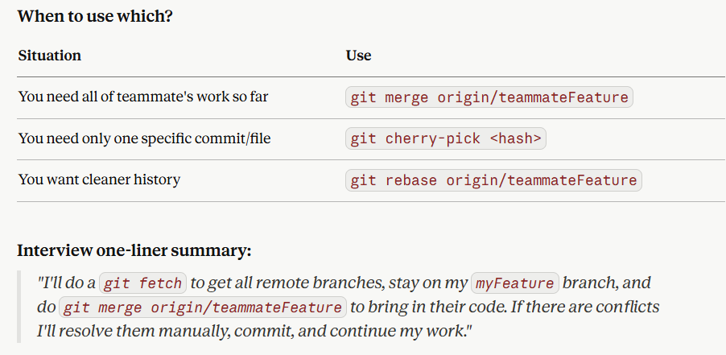
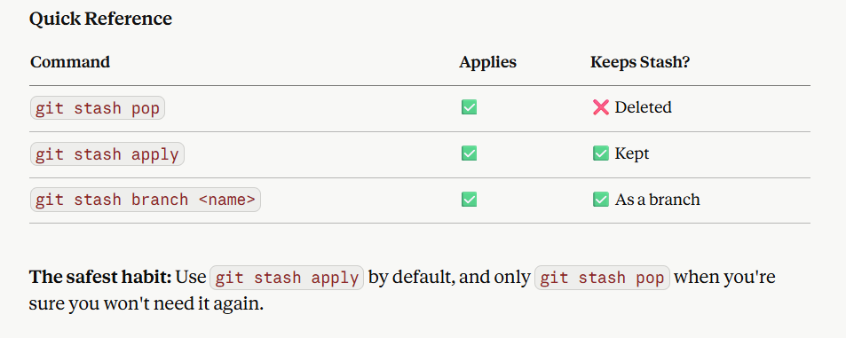
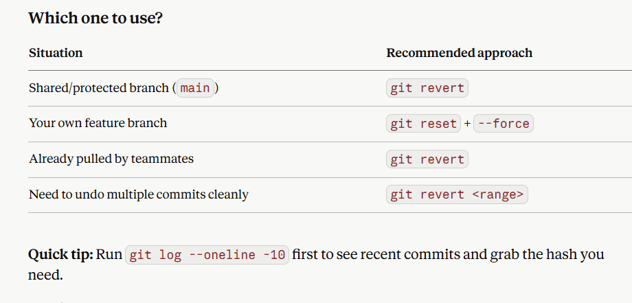

The Ideal Answer

"Since the code isn't in the stable branch yet, I would fetch the latest remote changes and then cherry-pick the specific commit or merge/rebase from my teammate's branch directly into my feature branch."

Two concrete approaches to mention:
Option 1 — Merge from their branch
bashgit fetch origin
git merge origin/teammate-feature-branch
Pull their branch and merge it into yours directly.
Option 2 — Cherry-pick a specific commit
bashgit fetch origin
git cherry-pick <commit-hash>
If you only need one specific file's changes, cherry-pick just that commit.

What the interviewer really wanted to hear:
ConceptWhat to sayFetch"I'll fetch to get all remote branches locally"Branch-to-branch merge"Then merge their branch into mine"Cherry-pick"Or cherry-pick just the commit I need"Communication"I'd also coordinate with my teammate to avoid conflicts"

Bonus points if you add:

"I'd also communicate with my teammate about it so we're aware of the dependency, and we'd plan to eventually have it go through the proper PR/review process before it hits the stable branch."

This shows team awareness, not just Git knowledge — which is what senior interviewers look for.You said: show complete workflow including switching merging etc to get the first question understand i'm working in my feature branch ex myFeature and we have one stabl…show complete workflow including switching merging etc to get the first question understand i'm working in my feature branch ex myFeature and we have one stable branch like integration/v1 and my teammate working in his feature branch ex: teammateFeature3:59 pmClaude responded: Complete Git Workflow — Getting Teammate's CodeComplete Git Workflow — Getting Teammate's Code
The Scenario
integration/v1     ← stable branch
├── myFeature      ← your branch
└── teammateFeature ← teammate's branch (has the file you need)

Step 1 — Save your current work first
bash# You're currently on your branch
git branch
# * myFeature

# Save your changes before doing anything
git add .
git commit -m "WIP: my current progress"

Step 2 — Fetch all latest remote branches
bash
git fetch origin

This downloads all remote branch info without touching your code. Now your Git knows about teammateFeature remotely.

Step 3 — Merge teammate's branch into yours
bash
# Make sure you're on YOUR branch
git checkout myFeature

# Merge teammate's branch into yours
git merge origin/teammateFeature
Now you have their file in your myFeature branch locally.

Step 4 — Handle conflicts (if any)
bash# Git will tell you if there are conflicts
# Open the conflicted file, you'll see this:

<<<<<<< HEAD (your code)
  your changes
=======
  teammate's changes
>>>>>>> origin/teammateFeature

# Fix it manually, then:
git add .
git commit -m "Merged teammateFeature, resolved conflicts"

Step 5 — Keep your branch updated with stable branch too
bash# Also merge integration/v1 so you're not behind stable
git merge origin/integration/v1

Full Picture of What's Happening
integration/v1   ──●──────────────────────────
                    \                          
teammateFeature      ●──●──● (has the file)   
                              \               
myFeature            ●──●──●──★  ← merge point
                                   (you now have
                                    teammate's file)

Alternative — Cherry-pick (if you need ONLY one specific file/commit)
bash# First find the specific commit hash from teammate's branch
git log origin/teammateFeature --oneline

# Output looks like:
# a1b2c3d added the required file
# e4f5g6h some other changes

# Pick ONLY that one commit into your branch
git cherry-pick a1b2c3d

Use this when you don't want all of their branch changes, just one specific commit.

When to use which?
SituationUseYou need all of teammate's work so fargit merge origin/teammateFeatureYou need only one specific commit/filegit cherry-pick <hash>You want cleaner historygit rebase origin/teammateFeature

Interview one-liner summary:

"I'll do a git fetch to get all remote branches, stay on my myFeature branch, and do git merge origin/teammateFeature to bring in their code. If there are conflicts I'll resolve them manually, commit, and continue my work."

====================================================

Some people do it this way too — both are correct:
bash
# Option 1 — fetch then merge (recommended, more control)
git fetch origin
git merge origin/integration/v1

# Option 2 — git pull directly (fetch + merge in one command)
git pull origin integration/v1

===========================================================

What you think you need to do (❌ unnecessary):
bash
git checkout integration/v1     # ❌ unnecessary switch
git pull                        # ❌ unnecessary
git checkout myFeature          # ❌ unnecessary switch back
git merge integration/v1        # ❌ unnecessary
That's 4 steps with 2 branch switches.

What you actually need to do (✅):
bash
# Stay on myFeature
git pull origin integration/v1  # done ✅
That's 1 step, no switching.

Why it works:
git pull origin integration/v1 means:
git pull  →  from 'origin'  →  take 'integration/v1'  →  merge into CURRENT branch

It directly pulls from the remote integration/v1 and merges into whatever branch you're currently on — which is myFeature.

You only need to checkout integration/v1 when you want to work on that branch. Just fetching its code into yours doesn't need a switch.You said:

 thwn i want to work on new feature then what should my approach i want to create new branch from stable integration/v1 branch from local rightthwn i want to work on new feature then what should my approach i want to create new branch from stable integration/v1 branch from local right4:34 pmClaude responded: Creating a New Feature Branch from integration/v1Creating a New Feature Branch from integration/v1
Yes, you're right! You should always create a new feature branch from the stable branch — but make sure it's up to date first.

Complete approach:
bash
# Step 1 — Switch to stable branch
git checkout integration/v1

# Step 2 — Pull latest code (make sure it's up to date)
git pull origin integration/v1

# Step 3 — Create new feature branch from here
git checkout -b myNewFeature
Now myNewFeature has the latest stable code as its base.

Why Step 2 matters:
Remote integration/v1  ──●──●──●──●  (latest)
Local integration/v1   ──●──●         (outdated ❌)
                                
myNewFeature created from outdated = missing commits ❌
Remote integration/v1  ──●──●──●──●  (latest)
Local integration/v1   ──●──●──●──●  (after pull ✅)
                                       \
myNewFeature                            ●  (fresh start ✅)

If you skip git pull, your new branch starts from old code and you'll have problems later.

Then push your new branch to remote:
bash
# First time pushing new branch to remote
git push -u origin myNewFeature

Full flow summary:
StepCommandWhySwitch to stablegit checkout integration/v1Start from stable baseUpdate itgit pull origin integration/v1Get latest commitsCreate new branchgit checkout -b myNewFeatureFresh feature branchPush to remotegit push -u origin myNewFeatureMake it available for team

=============================================================

===========================================================

Saving Git Stash Changes for Future Reference
When you do git stash pop, the stash is deleted after applying. Here are your options to preserve changes:

Option 1: Use git stash apply instead of git stash pop
bash
git stash apply stash@{0}
apply keeps the stash entry intact — it applies the changes without deleting the stash. You can reuse it anytime.

Option 2: Create a branch from a stash (best for long-term reference)
bash
git stash branch my-feature-backup stash@{0}
This creates a new branch with the stash changes applied — great for keeping work safe and visible in your repo history.

Option 3: Convert stash to a commit before popping
bash
# Apply and immediately commit
git stash apply stash@{0}
git add .
git commit -m "WIP: saving stash changes for reference"
Now it's in your git history permanently.

Option 4: Export stash as a patch file
bashgit stash show -p stash@{0} > my-changes.patch
This saves the diff to a .patch file you can store anywhere. To reapply later:
bashgit apply my-changes.patch

Option 5: Name your stashes so they're easy to find
bash
git stash push -m "my important changes"
Then list them:
bash
git stash list
# stash@{0}: On main: my important changes
And apply by name without dropping:
bashgit stash apply stash@{0}

Quick Reference
CommandAppliesKeeps Stash?git stash pop✅❌ Deletedgit stash apply✅✅ Keptgit stash branch <name>✅✅ As a branch
The safest habit: Use git stash apply by default, and only git stash pop when you're sure you won't need it again.

===============================================================================

====================================================

1. git revert — Safest (keeps history)
Creates a new commit that undoes the changes. Best for shared/public branches.
bash
# Revert the last commit
git revert HEAD

# Revert a specific commit
git revert <commit-hash>

# Push the revert commit
git push origin <branch-name>

2. git reset + force push — Rewrites history
Use only on your own branch or when you're sure no one else has pulled.
bash
# Undo last commit, keep changes in working directory
git reset --soft HEAD~1

# Undo last commit, discard changes completely
git reset --hard HEAD~1

# Force push to remote
git push origin <branch-name> --force

⚠️ --force rewrites history. Never do this on main/master in a shared repo.

3. Revert multiple commits
bash
# Revert a range of commits (oldest..newest)
git revert <older-hash>..<newer-hash>

# Push all revert commits at once
git push origin <branch-name>

4. Reset to a specific commit
bash
# Find the commit hash you want to go back to
git log --oneline

# Reset to that commit
git reset --hard <commit-hash>

# Force push
git push origin <branch-name> --force

Which one to use?
SituationRecommended approachShared/protected branch (main)git revertYour own feature branchgit reset + --forceAlready pulled by teammatesgit revertNeed to undo multiple commits cleanlygit revert <range>
Quick tip: Run git log --oneline -10 first to see recent commits and grab the hash you need.

======================================================================